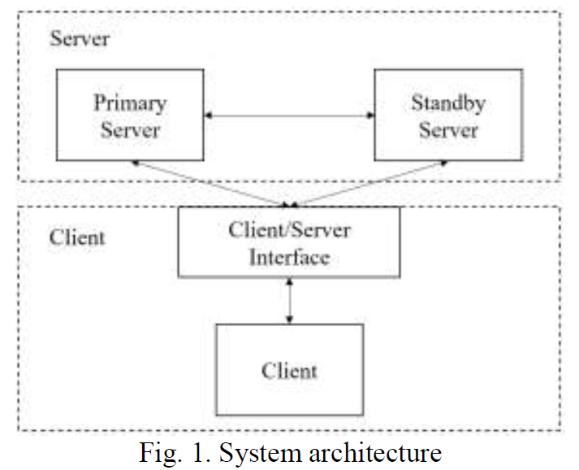
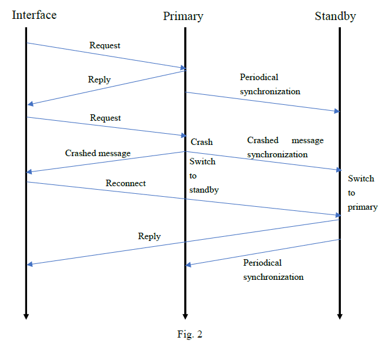

#COMP 5325 Distributed Computing Project Report

LEI Haiwen 16105237g

Wong King Yu 17001226g

Siu Yui Wing 17001615g

Wu Zongheng 17077449g 

##Description of Requirements
This project is to develop a simulation of a reliable client/server system that provides fault-tolerant
services. Invocations of servers are carried out via remote procedure call or remote
method invocation. The fault tolerance is achieved by employing standby redundancy: the main
server will be replaced by a standby copy when the main server fails.

##Function module design

###System architecture

In our project, an interface hides
the server details from the clients.A service is a set
of well-defined operations, and a server is an instance of a particular service running on a single
machine. When requesting a service, a client only needs to specify the nature of the service
through an attributed name. The exact location of the service and the server that provides such
a service will be determined by the interface.

In server side, two servers are maintained; one is called the primary
server, and the other is called the standby server as shown in Fig. 1. The primary and standby
are located on different machines to provide the fault-tolerant service. In order to guarantee fault-tolerant service, at least one server is alive. When a client
requests a service, the request is always first sent to the primary server if it is alive and response to the client; otherwise,
the client switches to connect to the standby and selects the standby server to a primary server.
The result returned by either copy of the server will be passed back
to the client.

###Server fault-tolerant function
Initially, both copies servers have the identical state which the action id is zero. The primary server periodically sends synchronization messages with newest action id to the standby server, which then updates its own
state to keep it consistent with the state of the primary.

Two servers maintain a file of
account balance and allow the clients to access it. The account balance file contains lines of
the format:account-id, balance.
Account-id is a numerical number and balance is a non-negative integer value.

There is a possibility that the primary crashes in the middle of its computation before it completes
the service of the request. In this case, the primary sends a synchroniztion message to the standby server to update the standby's state. Meanwile, the primary sends crashed messages to the interface and the standby to tell them it is crashed. The standby receives the synchronization and crashed messages, then updates its state and switch to primary server. The interface receives the crashed message, then diconnects with the crashed server, connects to the standby server, and the service continues as usual. The flow chart is shown in Fig. 2.

###Interface function
The interface program repeatedly displays the following menu of
options on the screen:

1. Look up balance
2. Withdraw an amount of money
3. Save an amount of money
4. Terminating program

For 1), The client inputs account id in interface and interface send it to server. The server opens the
account balance file and searches the account id. If it finds a match, the server sends result to the interface. The interface prints the
corresponding balance. If the server searches the entire file without finding a match, it returns a message
indicating that the account is not in the file amd the interface prints 'Account not found'.

For 2) and 3), The client inputs account id and an integer value in interface and interface send them to server. The server opens the
account balance file and searches the account id. If it finds a match, the server updates the balance accordingly by the client's request, then sends result to the interface. The interface prints the
corresponding balance. If the server searches the entire file without finding a match, it returns a message
indicating that the account is not in the file amd the interface prints 'Account not found'. The balance of an account must be non-negative all the time. If the execution of an operation
violates this property, the operation should be aborted.

After execution, the interface program clears the screen
and redisplays the master menu. This cycle continues until the client chooses the last option, which
terminates the program.

##Deployment detail

##User manual